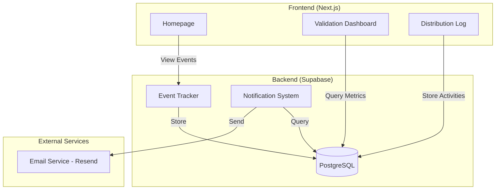

# Design Document: 30-Day Validation Sprint

## Overview

The 30-Day Validation Sprint is a minimal validation experiment designed to test whether indie SaaS founders will engage with Promptvexity's core loop: discover → fork → improve → share. This design prioritizes speed and validation over infrastructure, focusing on proving product-market fit with 50 signups and measurable engagement within 30 days.

### Design Principles

1. **Validation over Infrastructure**: Use simple, proven solutions rather than building complex systems
2. **Minimal Viable Implementation**: Each feature should be the simplest version that provides validation data
3. **No Premature Optimization**: Avoid rate limiting, caching, or advanced features until validation succeeds
4. **Leverage Existing Tools**: Use Supabase features, simple email services, and basic analytics rather than custom infrastructure

### Success Metrics

- 50+ total signups
- 20+ active users (created fork or problem)
- 10+ return users (visited on 2+ different days within 7 days)
- At least 1 fork chain with depth ≥ 2

## Architecture

### System Components

The validation sprint adds minimal new components to the existing Promptvexity architecture:



### Data Flow

1. **Event Tracking**: User actions trigger event records stored in `validation_events` table
2. **Fork Notifications**: Fork events trigger email notifications via Resend API
3. **Metrics Calculation**: Dashboard queries aggregate event data for validation metrics
4. **Distribution Tracking**: Manual entries logged in `distribution_activities` table

## Components and Interfaces

### 1. Event Tracking System

**Purpose**: Record user interactions for validation metrics calculation

**Database Schema**:

```sql
CREATE TABLE validation_events (
  id UUID PRIMARY KEY DEFAULT gen_random_uuid(),
  user_id UUID REFERENCES auth.users(id) ON DELETE SET NULL,
  event_type TEXT NOT NULL CHECK (event_type IN ('signup', 'problem_view', 'prompt_view', 'fork', 'vote')),
  target_id UUID,  -- problem_id, prompt_id, or NULL for signup
  created_at TIMESTAMPTZ DEFAULT NOW()
);

CREATE INDEX idx_validation_events_user ON validation_events(user_id);
CREATE INDEX idx_validation_events_type ON validation_events(event_type);
CREATE INDEX idx_validation_events_created ON validation_events(created_at);
```

**Implementation**:

- Server action: `trackEvent(eventType, targetId?)` in `lib/actions/validation.actions.ts`
- Called from existing components when users view problems, view prompts, fork, vote, or signup
- No client-side tracking library needed - simple server-side inserts

**Integration Points**:

- Problem page: Track `problem_view` on page load
- Prompt page: Track `prompt_view` on page load
- Fork action: Track `fork` when fork is created
- Vote action: Track `vote` when vote is cast
- Signup: Track `signup` in auth callback

### 2. Fork Notification System

**Purpose**: Send email notifications when prompts are forked to keep authors engaged

**Database Schema**:

```sql
CREATE TABLE fork_notifications (
  id UUID PRIMARY KEY DEFAULT gen_random_uuid(),
  prompt_id UUID REFERENCES prompts(id) ON DELETE CASCADE,
  forked_prompt_id UUID REFERENCES prompts(id) ON DELETE CASCADE,
  author_id UUID REFERENCES auth.users(id) ON DELETE CASCADE,
  forker_id UUID REFERENCES auth.users(id) ON DELETE CASCADE,
  sent_at TIMESTAMPTZ,
  error TEXT,
  created_at TIMESTAMPTZ DEFAULT NOW()
);

CREATE INDEX idx_fork_notifications_author ON fork_notifications(author_id);
CREATE INDEX idx_fork_notifications_sent ON fork_notifications(sent_at);
```

**Email Service Integration**:

- Use Resend (https://resend.com) for email delivery
- Free tier: 3,000 emails/month (sufficient for validation)
- Simple REST API, no complex setup
- Environment variable: `RESEND_API_KEY`

**Implementation**:

- Server action: `sendForkNotification(promptId, forkedPromptId)` in `lib/actions/notifications.actions.ts`
- Called immediately after fork creation in existing fork action
- Email template: Simple HTML with forker username and link to forked prompt
- Error handling: Log failures to `fork_notifications.error` field, don't block fork creation

**Email Template**:

```
Subject: [Promptvexity] Your prompt was forked!

Hi [author_username],

Great news! [forker_username] just forked your prompt "[prompt_title]".

View the fork: [link_to_forked_prompt]

This means your work is helping others solve real problems. Keep it up!

---
Promptvexity Team
```

### 3. Homepage Positioning Updates

**Purpose**: Target indie SaaS founders with clear value proposition and social proof

**Changes to `app/(marketing)/page.tsx`**:

1. **Hero Section Update**:
   - Replace "Solve real problems with prompts that are tested, compared, and improved"
   - With: "Production-ready prompts for real SaaS problems"
   - Add subtitle: "Built by indie founders, for indie founders"

2. **Social Proof Section** (new component):
   - Display user count dynamically
   - Show active fork chains count
   - Update every 60 seconds via ISR (already configured)

**Implementation**:

```typescript
// components/home/SocialProof.tsx
export async function SocialProof() {
  const supabase = createClient()
  
  const { count: userCount } = await supabase
    .from('profiles')
    .select('*', { count: 'exact', head: true })
  
  const { count: forkChainCount } = await supabase
    .from('prompts')
    .select('*', { count: 'exact', head: true })
    .not('parent_prompt_id', 'is', null)
  
  return (
    <div className="social-proof">
      <span>{userCount} indie founders</span>
      <span>{forkChainCount} prompt improvements</span>
    </div>
  )
}
```

### 4. Content Seeding System

**Purpose**: Populate platform with 50 high-quality SaaS problems before launch

**Seed Data Structure**:

```typescript
interface SeedProblem {
  title: string
  description: string
  industry: string
  tags: string[]
  example_prompts: {
    title: string
    user_prompt_template: string
    system_prompt?: string
    notes?: string
  }[]
}
```

**Problem Categories** (50 total):

1. **Financial Data Processing** (10 problems)
   - Invoice data extraction
   - Expense categorization
   - Revenue forecasting
   - Payment anomaly detection
   - Tax calculation assistance
   - Financial report summarization
   - Budget variance analysis
   - Cash flow prediction
   - Subscription churn analysis
   - Pricing optimization

2. **Support Ticket Analysis** (10 problems)
   - Ticket priority classification
   - Sentiment analysis
   - Auto-response generation
   - Issue categorization
   - Customer intent detection
   - Escalation prediction
   - Knowledge base suggestions
   - Bug report parsing
   - Feature request extraction
   - SLA compliance checking

3. **API Query Generation** (10 problems)
   - SQL query generation
   - GraphQL query building
   - REST API endpoint suggestions
   - Database schema inference
   - Query optimization suggestions
   - API documentation generation
   - Error message interpretation
   - Rate limit handling
   - Webhook payload parsing
   - API versioning guidance

4. **Content Operations** (10 problems)
   - SEO meta generation
   - Product description writing
   - Email subject line optimization
   - Social media post adaptation
   - Documentation summarization
   - Changelog generation
   - Release notes writing
   - User onboarding copy
   - Error message humanization
   - Help article generation

5. **Development Workflows** (10 problems)
   - Code review comments
   - Commit message generation
   - PR description writing
   - Test case generation
   - Bug reproduction steps
   - Refactoring suggestions
   - Documentation updates
   - API endpoint naming
   - Database migration planning
   - Deployment checklist generation

**Implementation**:

- Script: `scripts/seed-validation-problems.ts`
- Run once before launch: `npm run seed:validation`
- Creates problems in a dedicated "Promptvexity" workspace
- Each problem includes 1-2 starter prompts to demonstrate the pattern
- All content marked as `visibility: 'public'` and `is_listed: true`

### 5. Validation Metrics Dashboard

**Purpose**: Display real-time validation metrics to determine sprint success

**Location**: `/validation-dashboard` (admin-only route)

**Metrics Displayed**:

1. **Total Signups**: Count of `signup` events
2. **Active Users**: Count of users with `fork` or problem creation events
3. **Return Users**: Count of users with events on 2+ different days within 7-day window
4. **Fork Conversion Rate**: Percentage of `prompt_view` events followed by `fork` from same user
5. **Average Forks per Active User**: Total forks / active users
6. **Fork Chains**: List of prompts with depth ≥ 2
7. **Daily Signups Chart**: Line chart of signups over 30 days

**Implementation**:

```typescript
// app/validation-dashboard/page.tsx
export default async function ValidationDashboard() {
  const metrics = await calculateValidationMetrics()
  
  return (
    <div className="dashboard">
      <MetricCard title="Total Signups" value={metrics.totalSignups} target={50} />
      <MetricCard title="Active Users" value={metrics.activeUsers} target={20} />
      <MetricCard title="Return Users" value={metrics.returnUsers} target={10} />
      <MetricCard title="Fork Chains (depth ≥ 2)" value={metrics.forkChains} target={1} />
      
      <ChartSection data={metrics.dailySignups} />
      <ForkChainsList chains={metrics.forkChainDetails} />
    </div>
  )
}
```

**Metrics Calculation** (`lib/actions/validation.actions.ts`):

```typescript
export async function calculateValidationMetrics() {
  const supabase = createClient()
  
  // Total signups
  const { count: totalSignups } = await supabase
    .from('validation_events')
    .select('*', { count: 'exact', head: true })
    .eq('event_type', 'signup')
  
  // Active users (users with fork or problem creation)
  const { data: activeUserIds } = await supabase
    .from('validation_events')
    .select('user_id')
    .eq('event_type', 'fork')
  
  const { data: problemCreators } = await supabase
    .from('problems')
    .select('created_by')
  
  const activeUsers = new Set([
    ...activeUserIds.map(e => e.user_id),
    ...problemCreators.map(p => p.created_by)
  ]).size
  
  // Return users (users with events on 2+ different days within 7 days)
  const { data: allEvents } = await supabase
    .from('validation_events')
    .select('user_id, created_at')
    .order('created_at', { ascending: true })
  
  const userDays = new Map<string, Set<string>>()
  allEvents.forEach(event => {
    const day = event.created_at.split('T')[0]
    if (!userDays.has(event.user_id)) {
      userDays.set(event.user_id, new Set())
    }
    userDays.get(event.user_id)!.add(day)
  })
  
  const returnUsers = Array.from(userDays.values())
    .filter(days => days.size >= 2).length
  
  // Fork conversion rate
  const { data: promptViews } = await supabase
    .from('validation_events')
    .select('user_id, target_id, created_at')
    .eq('event_type', 'prompt_view')
  
  const { data: forks } = await supabase
    .from('validation_events')
    .select('user_id, target_id, created_at')
    .eq('event_type', 'fork')
  
  let conversions = 0
  promptViews.forEach(view => {
    const hasFork = forks.some(fork => 
      fork.user_id === view.user_id &&
      fork.target_id === view.target_id &&
      new Date(fork.created_at) > new Date(view.created_at)
    )
    if (hasFork) conversions++
  })
  
  const forkConversionRate = promptViews.length > 0 
    ? (conversions / promptViews.length) * 100 
    : 0
  
  // Fork chains
  const { data: allPrompts } = await supabase
    .from('prompts')
    .select('id, title, parent_prompt_id, created_by')
  
  const forkChains = calculateForkChainDepths(allPrompts)
  const deepChains = forkChains.filter(chain => chain.depth >= 2)
  
  return {
    totalSignups,
    activeUsers,
    returnUsers,
    forkConversionRate,
    avgForksPerActiveUser: activeUsers > 0 ? forks.length / activeUsers : 0,
    forkChains: deepChains.length,
    forkChainDetails: deepChains,
    dailySignups: calculateDailySignups(allEvents)
  }
}

function calculateForkChainDepths(prompts: Prompt[]) {
  const promptMap = new Map(prompts.map(p => [p.id, p]))
  
  return prompts.map(prompt => {
    let depth = 0
    let current = prompt
    
    while (current.parent_prompt_id) {
      depth++
      current = promptMap.get(current.parent_prompt_id)
      if (!current) break
    }
    
    return { promptId: prompt.id, title: prompt.title, depth }
  })
}
```

### 6. Distribution Activity Tracking

**Purpose**: Log outreach activities to correlate with signup patterns

**Database Schema**:

```sql
CREATE TABLE distribution_activities (
  id UUID PRIMARY KEY DEFAULT gen_random_uuid(),
  channel TEXT NOT NULL CHECK (channel IN ('twitter', 'discord', 'indie_hackers', 'slack', 'reddit', 'email', 'other')),
  description TEXT NOT NULL,
  target_audience TEXT,
  url TEXT,
  created_at TIMESTAMPTZ DEFAULT NOW()
);

CREATE INDEX idx_distribution_activities_channel ON distribution_activities(channel);
CREATE INDEX idx_distribution_activities_created ON distribution_activities(created_at);
```

**Implementation**:

- Simple form at `/validation-dashboard/distribution`
- Manual entry by product owner
- Fields: channel (dropdown), description (text), target audience (text), URL (optional)
- Display timeline of activities alongside signup chart for visual correlation

```typescript
// components/validation/DistributionLog.tsx
export function DistributionLog() {
  const [activities, setActivities] = useState([])
  
  async function handleSubmit(formData: FormData) {
    const supabase = createClient()
    
    await supabase.from('distribution_activities').insert({
      channel: formData.get('channel'),
      description: formData.get('description'),
      target_audience: formData.get('target_audience'),
      url: formData.get('url')
    })
    
    // Reload activities
    loadActivities()
  }
  
  return (
    <div>
      <form action={handleSubmit}>
        <select name="channel">
          <option value="twitter">Twitter DM</option>
          <option value="discord">Discord Post</option>
          <option value="indie_hackers">Indie Hackers</option>
          <option value="slack">Slack Share</option>
          <option value="reddit">Reddit</option>
          <option value="email">Email</option>
          <option value="other">Other</option>
        </select>
        <textarea name="description" placeholder="What did you share?" />
        <input name="target_audience" placeholder="Who did you target?" />
        <input name="url" placeholder="Link (optional)" />
        <button type="submit">Log Activity</button>
      </form>
      
      <ActivityTimeline activities={activities} />
    </div>
  )
}
```

## Data Models

### Validation Events

```typescript
interface ValidationEvent {
  id: string
  user_id: string | null
  event_type: 'signup' | 'problem_view' | 'prompt_view' | 'fork' | 'vote'
  target_id: string | null  // problem_id or prompt_id
  created_at: string
}
```

### Fork Notifications

```typescript
interface ForkNotification {
  id: string
  prompt_id: string
  forked_prompt_id: string
  author_id: string
  forker_id: string
  sent_at: string | null
  error: string | null
  created_at: string
}
```

### Distribution Activities

```typescript
interface DistributionActivity {
  id: string
  channel: 'twitter' | 'discord' | 'indie_hackers' | 'slack' | 'reddit' | 'email' | 'other'
  description: string
  target_audience: string | null
  url: string | null
  created_at: string
}
```

### Validation Metrics

```typescript
interface ValidationMetrics {
  totalSignups: number
  activeUsers: number
  returnUsers: number
  forkConversionRate: number
  avgForksPerActiveUser: number
  forkChains: number
  forkChainDetails: ForkChain[]
  dailySignups: DailySignup[]
}

interface ForkChain {
  promptId: string
  title: string
  depth: number
}

interface DailySignup {
  date: string
  count: number
}
```


## Correctness Properties

A property is a characteristic or behavior that should hold true across all valid executions of a system—essentially, a formal statement about what the system should do. Properties serve as the bridge between human-readable specifications and machine-verifiable correctness guarantees.

### Property 1: Social proof updates with user count

*For any* state where users exist in the system, the homepage social proof section should display the current count of users.

**Validates: Requirements 1.4**

### Property 2: Seeded and user-generated content render identically

*For any* problem (whether seeded or user-generated), the platform should render it using the same interface components and styling.

**Validates: Requirements 2.4**

### Property 3: Fork events trigger author notifications

*For any* fork creation, the notification system should send an email to the original prompt author.

**Validates: Requirements 3.1**

### Property 4: Fork notifications contain forker username

*For any* fork notification email, the email body should contain the username of the user who created the fork.

**Validates: Requirements 3.2**

### Property 5: Fork notifications contain forked prompt link

*For any* fork notification email, the email body should contain a valid link to the forked prompt.

**Validates: Requirements 3.3**

### Property 6: Fork notifications sent within time limit

*For any* fork notification, the difference between the fork creation timestamp and the email sent_at timestamp should be less than or equal to 5 minutes.

**Validates: Requirements 3.4**

### Property 7: User actions trigger event recording

*For any* user action (problem view, prompt view, fork, vote, or signup), the event tracker should create a corresponding event record in the validation_events table.

**Validates: Requirements 4.1, 4.2, 4.3, 4.4, 4.5**

### Property 8: Events contain required core fields

*For any* validation event, the record should contain non-null values for user_id, event_type, and created_at (timestamp).

**Validates: Requirements 4.6**

### Property 9: Target events contain target_id

*For any* validation event of type problem_view, prompt_view, fork, or vote, the record should contain a non-null target_id field.

**Validates: Requirements 4.7**

### Property 10: Fork conversion rate calculation accuracy

*For any* set of prompt_view and fork events, the calculated fork conversion rate should equal the percentage of prompt views that were followed by a fork of the same prompt by the same user.

**Validates: Requirements 5.1**

### Property 11: Return rate calculation accuracy

*For any* set of validation events, the calculated return rate should equal the percentage of users who have events on at least two different calendar days within a 7-day window.

**Validates: Requirements 5.2**

### Property 12: Average forks per active user calculation

*For any* set of users and fork events, the calculated average forks per active user should equal the total number of forks divided by the number of users who have created at least one fork or problem.

**Validates: Requirements 5.3**

### Property 13: Fork chain depth calculation

*For any* prompt with parent_prompt_id relationships, the calculated depth should equal the number of parent hops from the prompt to the root prompt (prompt with no parent).

**Validates: Requirements 5.4, 8.2, 8.3**

### Property 14: Metric counting accuracy

*For any* set of validation events and users, the counts for total signups, active users, and return users should accurately reflect the definitions: signups = signup events, active users = users with forks or problem creations, return users = users with events on 2+ different days within 7 days.

**Validates: Requirements 5.5**

### Property 15: Distribution activities contain required fields

*For any* distribution activity record, it should contain non-null values for channel, description, and created_at.

**Validates: Requirements 6.2**

### Property 16: Signup and activity temporal correlation

*For any* signup event and distribution activity, the system should be able to determine whether the signup occurred within a specified time window after the activity.

**Validates: Requirements 6.4**

### Property 17: Fork parent relationship recording

*For any* fork creation, the resulting prompt record should have a non-null parent_prompt_id that references the original prompt.

**Validates: Requirements 8.1**

### Property 18: Fork chain visualization for deep chains

*For any* prompt with calculated depth greater than 1, the prompt detail page should render a fork chain visualization component.

**Validates: Requirements 8.4**

### Property 19: Validation threshold reporting

*For any* validation metric (signups, active users, return users, fork chains), the dashboard should correctly report whether the metric has reached its target threshold (50, 20, 10, and 1 respectively).

**Validates: Requirements 9.1, 9.2, 9.3, 9.4**

## Error Handling

### Event Tracking Failures

- **Scenario**: Database insert fails when recording an event
- **Handling**: Log error to console, do not block user action
- **Rationale**: Event tracking is for analytics; failures should not impact user experience

### Email Notification Failures

- **Scenario**: Resend API returns error or times out
- **Handling**: 
  - Record error in `fork_notifications.error` field
  - Log to console for monitoring
  - Do not retry automatically (avoid spam)
  - Do not block fork creation
- **Rationale**: Notifications are engagement features, not critical path

### Metrics Calculation Errors

- **Scenario**: Query fails or returns unexpected data
- **Handling**:
  - Display "N/A" or "Error loading" in dashboard
  - Log full error details to console
  - Provide manual refresh button
- **Rationale**: Dashboard is admin-only; graceful degradation acceptable

### Seeding Script Failures

- **Scenario**: Seed script fails partway through
- **Handling**:
  - Make script idempotent (check for existing problems before inserting)
  - Log which problems were created successfully
  - Allow re-running without duplicates
- **Rationale**: Seeding is one-time operation; manual intervention acceptable

### Missing User Data

- **Scenario**: User deleted but events reference their ID
- **Handling**:
  - Use `ON DELETE SET NULL` for user_id in validation_events
  - Display "Deleted User" in dashboard when user_id is null
  - Exclude null user_ids from active/return user calculations
- **Rationale**: Historical data should persist even if users leave

## Testing Strategy

### Dual Testing Approach

This feature requires both unit tests and property-based tests for comprehensive validation:

- **Unit tests**: Verify specific examples, edge cases, and integration points
- **Property tests**: Verify universal properties across randomized inputs

### Unit Testing Focus

Unit tests should cover:

1. **Specific Examples**:
   - Homepage displays exact value proposition text
   - Seeded content count equals 50
   - Distribution log includes specific channel options
   - Pricing page exists and renders
   - Validation dashboard displays all required metrics

2. **Edge Cases**:
   - Event tracking when user is not authenticated
   - Fork notification when author has no email
   - Metrics calculation with zero events
   - Fork chain depth for circular references (should not occur, but test handling)

3. **Integration Points**:
   - Event tracking integration with existing fork action
   - Email service integration with Resend API (mock in tests)
   - Dashboard queries against actual database schema

4. **Scope Exclusions**:
   - Verify no rate limiting middleware exists
   - Verify no Redis dependencies in package.json
   - Verify no advanced abuse detection beyond basic reporting
   - Verify no advanced search facets beyond basic filtering

### Property-Based Testing Configuration

- **Library**: Use `fast-check` for TypeScript property-based testing
- **Minimum iterations**: 100 per property test
- **Tag format**: `Feature: 30-day-validation-sprint, Property {number}: {property_text}`

### Property Testing Focus

Property tests should verify:

1. **Event Recording Properties** (Properties 7-9):
   - Generate random user actions and verify events are created
   - Generate random events and verify required fields are present
   - Generate random target events and verify target_id is present

2. **Calculation Properties** (Properties 10-14, 19):
   - Generate random event datasets and verify metric calculations
   - Generate random fork chains and verify depth calculations
   - Generate random thresholds and verify comparison logic

3. **Notification Properties** (Properties 3-6):
   - Generate random fork scenarios and verify notifications are sent
   - Generate random notification data and verify email content
   - Generate random timestamps and verify timing constraints

4. **Rendering Properties** (Properties 1, 2, 18):
   - Generate random user counts and verify social proof updates
   - Generate random problems (seeded vs user) and verify identical rendering
   - Generate random fork chains and verify visualization appears

5. **Data Integrity Properties** (Properties 15-17):
   - Generate random distribution activities and verify required fields
   - Generate random forks and verify parent relationships
   - Generate random temporal data and verify correlation logic

### Test Implementation Example

```typescript
// Example property test for fork chain depth calculation
import fc from 'fast-check'
import { describe, it, expect } from 'vitest'
import { calculateForkChainDepth } from '@/lib/actions/validation.actions'

describe('Feature: 30-day-validation-sprint, Property 13: Fork chain depth calculation', () => {
  it('should correctly calculate depth for any fork chain', () => {
    fc.assert(
      fc.property(
        fc.array(fc.record({
          id: fc.uuid(),
          parent_prompt_id: fc.option(fc.uuid(), { nil: null })
        })),
        (prompts) => {
          // For each prompt, calculate depth
          prompts.forEach(prompt => {
            const depth = calculateForkChainDepth(prompt.id, prompts)
            
            // Verify depth equals number of parent hops
            let expectedDepth = 0
            let current = prompt
            const visited = new Set()
            
            while (current.parent_prompt_id && !visited.has(current.id)) {
              visited.add(current.id)
              expectedDepth++
              current = prompts.find(p => p.id === current.parent_prompt_id)
              if (!current) break
            }
            
            expect(depth).toBe(expectedDepth)
          })
        }
      ),
      { numRuns: 100 }
    )
  })
})
```

### Testing Priorities

1. **High Priority** (must pass before launch):
   - Event tracking properties (7-9)
   - Fork notification properties (3-6)
   - Metrics calculation properties (10-14)
   - Fork chain depth calculation (13)

2. **Medium Priority** (should pass before launch):
   - Rendering properties (1, 2, 18)
   - Data integrity properties (15-17)
   - Validation threshold reporting (19)

3. **Low Priority** (nice to have):
   - Scope exclusion tests (10.1, 10.3-10.5)
   - Documentation tests (7.3)

### Manual Testing Checklist

Before launch, manually verify:

1. Send test fork notification email and confirm receipt
2. Create test fork chain with depth ≥ 2 and verify visualization
3. Log test distribution activity and verify it appears in timeline
4. View validation dashboard and verify all metrics display correctly
5. Create test user and verify social proof updates on homepage
6. View seeded problems and verify they match user-generated problem styling

