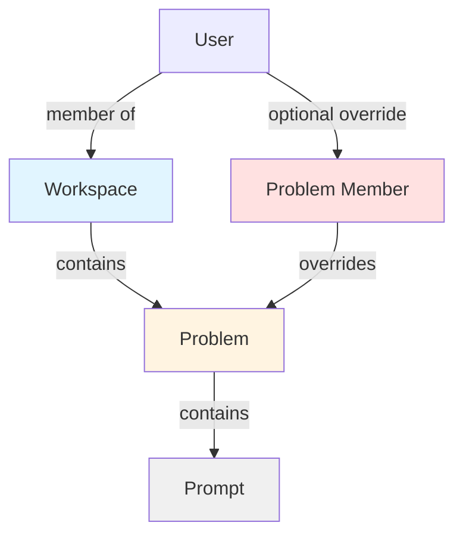
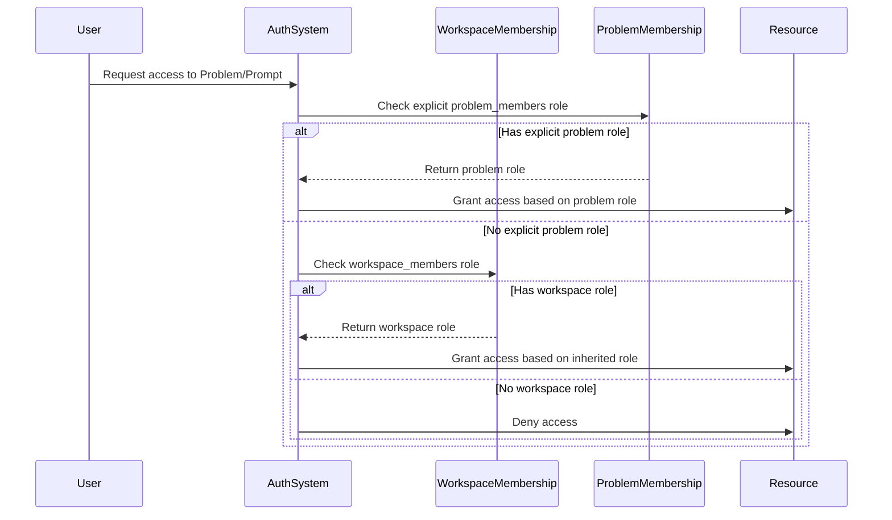

# Design Document: Workspace Permission System

## Overview

The workspace permission system implements a clean two-layer authorization model for Promptvevity that establishes clear boundaries between collaboration spaces (workspaces) and resources (problems/prompts). The current system has overlapping permission flags and unclear authorization boundaries. This design replaces the fragmented permission model with a hierarchical role-based access control (RBAC) system where workspace membership provides base permissions and problem membership provides optional overrides.

The core principle is: workspace = collaboration boundary, problem = resource inside workspace, problem membership = optional override, prompt permissions = inherited from problem, created_by = attribution only (not authorization).

## Architecture



## Main Authorization Flow




## Components and Interfaces

### Permission Tables Summary

**Workspace Role Permissions**:

| Role | View Workspace | Create Problems | Manage Members |
|------|----------------|-----------------|----------------|
| owner | ✓ | ✓ | ✓ |
| admin | ✓ | ✓ | ✓ |
| member | ✓ | ✓ | ✗ |
| viewer | ✓ | ✗ | ✗ |

**Problem Role Permissions**:

| Role | View Problem | Edit Problem | Submit Prompt | Manage Members |
|------|--------------|--------------|---------------|----------------|
| owner | ✓ | ✓ | ✓ | ✓ |
| admin | ✓ | ✓ | ✓ | ✓ |
| member | ✓ | ✗ | ✓ | ✗ |
| viewer | ✓ | ✗ | ✗ | ✗ |

**Prompt Editing Permissions**:

| Role | Edit Own Prompts | Edit Others' Prompts |
|------|------------------|----------------------|
| owner | ✓ | ✓ |
| admin | ✓ | ✓ |
| member | ✓ | ✗ |
| viewer | ✗ | ✗ |

**Key Clarifications**:
- Members can submit prompts and edit their own prompts
- Members CANNOT edit problem definitions (title, description, visibility, etc.)
- Only owner and admin roles can edit problem metadata
- created_by is used for attribution + ownership check for member-level edit rights
- Admins/owners can edit any prompt regardless of created_by

### Component 1: Workspace Membership Manager

**Purpose**: Manages workspace-level roles and membership

**Interface**:
```typescript
interface WorkspaceMembershipManager {
  addMember(workspaceId: UUID, userId: UUID, role: WorkspaceRole): Promise<void>
  removeMember(workspaceId: UUID, userId: UUID): Promise<void>
  updateRole(workspaceId: UUID, userId: UUID, role: WorkspaceRole): Promise<void>
  getRole(workspaceId: UUID, userId: UUID): Promise<WorkspaceRole | null>
  isMember(workspaceId: UUID, userId: UUID): Promise<boolean>
}

type WorkspaceRole = 'owner' | 'admin' | 'member' | 'viewer'
```

**Responsibilities**:
- Enforce workspace membership constraints
- Validate role transitions (e.g., must have at least one owner)
- Cascade membership removal to problem memberships
- Maintain workspace_members table integrity

### Component 2: Problem Membership Manager

**Purpose**: Manages problem-level role overrides

**Interface**:
```typescript
interface ProblemMembershipManager {
  addMember(problemId: UUID, userId: UUID, role: ProblemRole): Promise<void>
  removeMember(problemId: UUID, userId: UUID): Promise<void>
  updateRole(problemId: UUID, userId: UUID, role: ProblemRole): Promise<void>
  getRole(problemId: UUID, userId: UUID): Promise<ProblemRole | null>
  getEffectiveRole(problemId: UUID, userId: UUID): Promise<ProblemRole | null>
}

type ProblemRole = 'owner' | 'admin' | 'member' | 'viewer'
```

**Responsibilities**:
- Manage explicit problem-level role overrides
- Require workspace membership before adding problem membership
- Calculate effective role (explicit problem role OR inherited workspace role)
- Enforce unique constraint on (problem_id, user_id)

### Component 3: Authorization Service

**Purpose**: Central authorization decision engine

**Interface**:
```typescript
interface AuthorizationService {
  canViewProblem(problemId: UUID, userId: UUID): Promise<boolean>
  canEditProblem(problemId: UUID, userId: UUID): Promise<boolean>
  canManageProblem(problemId: UUID, userId: UUID): Promise<boolean>
  canManageWorkspace(workspaceId: UUID, userId: UUID): Promise<boolean>
  canViewWorkspace(workspaceId: UUID, userId: UUID): Promise<boolean>
  canSubmitPrompt(problemId: UUID, userId: UUID): Promise<boolean>
  canEditPrompt(promptId: UUID, userId: UUID): Promise<boolean>
  canManagePrompt(promptId: UUID, userId: UUID): Promise<boolean>
  canViewPrompt(promptId: UUID, userId: UUID): Promise<boolean>
}
```

**Responsibilities**:
- Implement core authorization rule: effective_role = explicit problem role ?? inherited workspace role ?? no access
- Handle visibility semantics (public, workspace, private)
- Delegate to helper functions in Postgres for RLS policies
- Provide consistent authorization decisions across application and database layers


## Data Models

### Model 1: workspace_members (existing, modified)

```sql
CREATE TABLE workspace_members (
  workspace_id UUID NOT NULL REFERENCES workspaces(id) ON DELETE CASCADE,
  user_id UUID NOT NULL REFERENCES auth.users(id) ON DELETE CASCADE,
  role TEXT NOT NULL CHECK (role IN ('owner', 'admin', 'member', 'viewer')),
  created_at TIMESTAMPTZ NOT NULL DEFAULT NOW(),
  updated_at TIMESTAMPTZ NOT NULL DEFAULT NOW(),
  PRIMARY KEY (workspace_id, user_id)
);
```

**Validation Rules**:
- role must be one of: owner, admin, member, viewer
- At least one owner must exist per workspace
- Only owner can promote another owner. Admins cannot create owners.
- workspace_id must reference valid workspace
- user_id must reference valid user
- Unique constraint on (workspace_id, user_id)

**Role Hierarchy**:
- owner: Full control, can delete workspace, manage all members
- admin: Can manage members (except owners), manage all problems
- member: Can create problems, view workspace problems (CANNOT edit problem definitions)
- viewer: Read-only access to workspace problems

### Model 2: problem_members (new table)

```sql
CREATE TABLE problem_members (
  problem_id UUID NOT NULL REFERENCES problems(id) ON DELETE CASCADE,
  user_id UUID NOT NULL REFERENCES auth.users(id) ON DELETE CASCADE,
  role TEXT NOT NULL CHECK (role IN ('owner', 'admin', 'member', 'viewer')),
  created_at TIMESTAMPTZ NOT NULL DEFAULT NOW(),
  updated_at TIMESTAMPTZ NOT NULL DEFAULT NOW(),
  PRIMARY KEY (problem_id, user_id)
);

-- Trigger function to validate workspace membership
CREATE OR REPLACE FUNCTION validate_problem_member_workspace()
RETURNS TRIGGER AS $$
BEGIN
  IF NOT EXISTS (
    SELECT 1 FROM problems p
    JOIN workspace_members wm ON wm.workspace_id = p.workspace_id
    WHERE p.id = NEW.problem_id AND wm.user_id = NEW.user_id
  ) THEN
    RAISE EXCEPTION 'User must be workspace member before becoming problem member';
  END IF;
  RETURN NEW;
END;
$$ LANGUAGE plpgsql;

-- Trigger to enforce workspace membership prerequisite
CREATE TRIGGER validate_problem_member_workspace_trigger
  BEFORE INSERT OR UPDATE ON problem_members
  FOR EACH ROW
  EXECUTE FUNCTION validate_problem_member_workspace();
```

**Validation Rules**:
- role must be one of: owner, admin, member, viewer
- User must be workspace member before becoming problem member (enforced by trigger)
- problem_id must reference valid problem
- user_id must reference valid user
- Composite primary key on (problem_id, user_id) - no surrogate id

**Role Hierarchy**:
- owner: Full control over problem and all prompts
- admin: Can manage problem, edit all prompts
- member: Can submit prompts, edit own prompts (CANNOT edit problem metadata)
- viewer: Read-only access to problem and prompts

### Model 3: problems (modified)

```sql
ALTER TABLE problems
  ALTER COLUMN workspace_id SET NOT NULL,
  ADD COLUMN visibility TEXT NOT NULL DEFAULT 'workspace' 
    CHECK (visibility IN ('public', 'workspace', 'private')),
  DROP COLUMN IF EXISTS is_listed,
  ADD COLUMN is_listed BOOLEAN NOT NULL DEFAULT TRUE,
  DROP COLUMN IF EXISTS is_hidden,
  ADD COLUMN is_hidden BOOLEAN NOT NULL DEFAULT FALSE,
  ADD COLUMN is_deleted BOOLEAN NOT NULL DEFAULT FALSE;
```

**Visibility Semantics**:
- public: Visible to anyone if is_listed=true AND is_hidden=false
- workspace: Only visible to workspace members
- private: Only visible to explicit problem members OR workspace admins/owners

**Flag Semantics**:
- is_listed: Controls discoverability (appears in listings/search)
- is_hidden: Moderation flag (hidden by moderators)
- is_deleted: Soft delete flag (lifecycle management)


### Model 4: prompts (modified)

```sql
ALTER TABLE prompts
  DROP COLUMN IF EXISTS is_listed,
  ADD COLUMN is_listed BOOLEAN NOT NULL DEFAULT TRUE,
  DROP COLUMN IF EXISTS is_hidden,
  ADD COLUMN is_hidden BOOLEAN NOT NULL DEFAULT FALSE,
  ADD COLUMN is_deleted BOOLEAN NOT NULL DEFAULT FALSE;
```

**Visibility Inheritance**:
- Prompts fully inherit visibility from their parent problem
- No separate visibility column on prompts table
- Simplifies authorization logic and reduces complexity

**Authorization Rule**:
- Prompt permissions = Problem permissions (inherited through problem_id)
- created_by is attribution + ownership check for limited edit rights
- Members can edit only their own prompts (checked via created_by)
- Admins/owners can edit any prompt
- This is NOT full authorization, but IS used for member-level edit checks
- Effective role comes from problem's effective role


## Algorithmic Pseudocode

### Helper Function: Get Explicit Problem Role

```pascal
ALGORITHM get_explicit_problem_role(problem_id, user_id)
INPUT: problem_id of type UUID, user_id of type UUID
OUTPUT: role of type ProblemRole or NULL

BEGIN
  // Check for explicit problem membership only
  explicit_role ← SELECT role FROM problem_members 
                  WHERE problem_id = problem_id AND user_id = user_id
  
  RETURN explicit_role  // NULL if no explicit membership
END
```

**Preconditions**:
- problem_id and user_id are provided

**Postconditions**:
- Returns explicit problem role if exists in problem_members table
- Returns NULL if no explicit problem membership exists
- Does NOT check workspace membership

**Loop Invariants**: N/A (no loops)

### Core Authorization Algorithm

```pascal
ALGORITHM get_effective_problem_role(problem_id, user_id)
INPUT: problem_id of type UUID, user_id of type UUID
OUTPUT: role of type ProblemRole or NULL

BEGIN
  // Step 1: Check for explicit problem membership
  explicit_role ← get_explicit_problem_role(problem_id, user_id)
  
  IF explicit_role IS NOT NULL THEN
    RETURN explicit_role
  END IF
  
  // Step 2: Get workspace_id from problem
  workspace_id ← SELECT workspace_id FROM problems WHERE id = problem_id
  
  IF workspace_id IS NULL THEN
    RETURN NULL
  END IF
  
  // Step 3: Check for workspace membership
  workspace_role ← get_workspace_role(workspace_id, user_id)
  
  RETURN workspace_role  // May be NULL if not a workspace member
END
```

**Preconditions**:
- problem_id references a valid problem
- user_id references a valid user

**Postconditions**:
- Returns explicit problem role if exists
- Otherwise returns inherited workspace role if exists
- Otherwise returns NULL (no access)

**Loop Invariants**: N/A (no loops)

### Role Precedence Rule

**Critical Rule: Explicit Problem Role Precedence is Absolute**

The explicit problem role ALWAYS takes precedence over the workspace role, even if the problem role is lower than the workspace role.

**Examples**:
- workspace role = admin, problem role = viewer → effective role = viewer
- workspace role = owner, problem role = member → effective role = member
- workspace role = member, problem role = admin → effective role = admin

This is NOT a max(workspace_role, problem_role) operation. The explicit problem role wins completely if it exists, otherwise the workspace role is used.

**Rationale**: This ensures private problem isolation and prevents unintended privilege escalation. Problem-level overrides must be absolute to maintain security boundaries.

**INCORRECT** (do not implement):
```typescript
// WRONG: Taking maximum role
effective_role = max(workspace_role, problem_role)
```

**CORRECT** (implemented):
```typescript
// RIGHT: Explicit problem role wins completely
effective_role = problem_role ?? workspace_role ?? null
```

### Visibility Check Algorithm

```pascal
ALGORITHM can_view_problem(problem_id, user_id)
INPUT: problem_id of type UUID, user_id of type UUID (may be NULL for anonymous)
OUTPUT: can_view of type boolean

BEGIN
  // Step 1: Get problem details
  problem ← SELECT visibility, is_listed, is_hidden, is_deleted, workspace_id 
            FROM problems WHERE id = problem_id
  
  IF problem IS NULL OR problem.is_deleted = true THEN
    RETURN false
  END IF
  
  // Step 2: Check moderation flags
  IF problem.is_hidden = true THEN
    // Hidden problems require workspace admin/owner OR problem admin/owner
    explicit_role ← get_explicit_problem_role(problem_id, user_id)
    workspace_role ← get_workspace_role(problem.workspace_id, user_id)
    
    IF COALESCE(explicit_role, '') IN ('admin', 'owner')
       OR COALESCE(workspace_role, '') IN ('admin', 'owner') THEN
      // Continue to visibility check
    ELSE
      RETURN false
    END IF
  END IF
  
  // Step 3: Check visibility
  IF problem.visibility = 'public' THEN
    RETURN problem.is_listed = true
  ELSE IF problem.visibility = 'workspace' THEN
    // Must be workspace member
    is_member ← is_workspace_member(problem.workspace_id, user_id)
    RETURN is_member = true
  ELSE IF problem.visibility = 'private' THEN
    // Must be explicit problem member OR workspace admin/owner
    explicit_role ← get_explicit_problem_role(problem_id, user_id)
    
    IF explicit_role IS NOT NULL THEN
      RETURN true  // Has explicit problem membership
    END IF
    
    // Check if user is workspace admin or owner
    workspace_role ← get_workspace_role(problem.workspace_id, user_id)
    RETURN workspace_role IN ('admin', 'owner')
  END IF
  
  RETURN false
END
```

**Preconditions**:
- problem_id is provided (may not exist)
- user_id may be NULL for anonymous users

**Postconditions**:
- Returns true if and only if user can view the problem
- Respects visibility, listing, and moderation flags
- Handles anonymous users correctly

**Loop Invariants**: N/A (no loops)


### Permission Check Algorithm

```pascal
ALGORITHM can_edit_problem(problem_id, user_id)
INPUT: problem_id of type UUID, user_id of type UUID
OUTPUT: can_edit of type boolean

BEGIN
  IF user_id IS NULL THEN
    RETURN false
  END IF
  
  effective_role ← get_effective_problem_role(problem_id, user_id)
  
  // Only owner and admin can edit problem definitions
  // Members can submit prompts but NOT edit problem metadata
  RETURN effective_role IN ('owner', 'admin')
END
```

**Preconditions**:
- problem_id references a valid problem
- user_id is provided

**Postconditions**:
- Returns true if user has owner or admin role
- Returns false for member, viewer, or no role
- Members CANNOT edit problem definitions

**Loop Invariants**: N/A (no loops)

```pascal
ALGORITHM can_manage_problem(problem_id, user_id)
INPUT: problem_id of type UUID, user_id of type UUID
OUTPUT: can_manage of type boolean

BEGIN
  IF user_id IS NULL THEN
    RETURN false
  END IF
  
  effective_role ← get_effective_problem_role(problem_id, user_id)
  
  // Only owner and admin can manage (delete, change visibility, manage members)
  RETURN effective_role IN ('owner', 'admin')
END
```

**Preconditions**:
- problem_id references a valid problem
- user_id is provided

**Postconditions**:
- Returns true if user has owner or admin role
- Returns false for member, viewer, or no role

**Loop Invariants**: N/A (no loops)

### Workspace Member Removal Cascade Algorithm

```pascal
ALGORITHM remove_workspace_member(workspace_id, user_id)
INPUT: workspace_id of type UUID, user_id of type UUID
OUTPUT: void (side effects: removes memberships)

BEGIN
  // Step 1: Verify at least one owner will remain BEFORE deletion
  owner_count ← SELECT COUNT(*) FROM workspace_members
                WHERE workspace_id = workspace_id 
                  AND role = 'owner'
                  AND user_id != user_id  // Exclude user being removed
  
  IF owner_count = 0 THEN
    RAISE EXCEPTION 'Cannot remove last owner from workspace'
  END IF
  
  // Step 2: Remove all problem memberships in this workspace
  DELETE FROM problem_members
  WHERE user_id = user_id
    AND problem_id IN (
      SELECT id FROM problems WHERE workspace_id = workspace_id
    )
  
  // Step 3: Remove workspace membership
  DELETE FROM workspace_members
  WHERE workspace_id = workspace_id AND user_id = user_id
END
```

**Preconditions**:
- workspace_id references a valid workspace
- user_id references a valid user
- User is a workspace member

**Postconditions**:
- At least one owner remains in workspace (validated BEFORE deletion)
- User's problem memberships in workspace are removed
- User's workspace membership is removed
- Transaction rolled back if last owner would be removed

**Loop Invariants**: N/A (no loops, but DELETE operations are atomic)


## Key Functions with Formal Specifications

### Function 1: is_workspace_member()

```sql
CREATE OR REPLACE FUNCTION is_workspace_member(p_workspace_id UUID, p_user_id UUID)
RETURNS BOOLEAN
LANGUAGE sql
STABLE
SECURITY DEFINER
SET search_path = public
AS $$
  SELECT EXISTS (
    SELECT 1 FROM workspace_members
    WHERE workspace_id = p_workspace_id
      AND user_id = p_user_id
  );
$$;
```

**Preconditions**:
- p_workspace_id and p_user_id are provided (may not exist in database)

**Postconditions**:
- Returns true if and only if user is a member of the workspace
- Returns false if workspace or user doesn't exist
- No side effects

**Loop Invariants**: N/A

### Function 2: get_workspace_role()

```sql
CREATE OR REPLACE FUNCTION get_workspace_role(p_workspace_id UUID, p_user_id UUID)
RETURNS TEXT
LANGUAGE sql
STABLE
SECURITY DEFINER
SET search_path = public
AS $$
  SELECT role FROM workspace_members
  WHERE workspace_id = p_workspace_id
    AND user_id = p_user_id
  LIMIT 1;
$$;
```

**Preconditions**:
- p_workspace_id and p_user_id are provided

**Postconditions**:
- Returns role text if user is workspace member
- Returns NULL if user is not workspace member
- No side effects

**Loop Invariants**: N/A

### Function 3: get_explicit_problem_role()

```sql
CREATE OR REPLACE FUNCTION get_explicit_problem_role(p_problem_id UUID, p_user_id UUID)
RETURNS TEXT
LANGUAGE sql
STABLE
SECURITY DEFINER
SET search_path = public
AS $$
  SELECT role FROM problem_members
  WHERE problem_id = p_problem_id
    AND user_id = p_user_id
  LIMIT 1;
$$;
```

**Preconditions**:
- p_problem_id and p_user_id are provided

**Postconditions**:
- Returns explicit problem role if exists in problem_members table
- Returns NULL if no explicit problem membership exists
- Does NOT check workspace membership
- No side effects

**Loop Invariants**: N/A

### Function 4: get_problem_role()

```sql
CREATE OR REPLACE FUNCTION get_problem_role(p_problem_id UUID, p_user_id UUID)
RETURNS TEXT
LANGUAGE plpgsql
STABLE
SECURITY DEFINER
SET search_path = public
AS $$
DECLARE
  v_explicit_role TEXT;
  v_workspace_id UUID;
  v_workspace_role TEXT;
BEGIN
  -- Check for explicit problem membership
  v_explicit_role := get_explicit_problem_role(p_problem_id, p_user_id);
  
  IF v_explicit_role IS NOT NULL THEN
    RETURN v_explicit_role;
  END IF;
  
  -- Get workspace_id from problem
  SELECT workspace_id INTO v_workspace_id
  FROM problems
  WHERE id = p_problem_id
  LIMIT 1;
  
  IF NOT FOUND OR v_workspace_id IS NULL THEN
    RETURN NULL;
  END IF;
  
  -- Check workspace membership
  v_workspace_role := get_workspace_role(v_workspace_id, p_user_id);
  
  RETURN v_workspace_role;
END;
$$;
```

**Preconditions**:
- p_problem_id and p_user_id are provided

**Postconditions**:
- Returns explicit problem role if exists (via get_explicit_problem_role)
- Otherwise returns inherited workspace role if exists (via get_workspace_role)
- Otherwise returns NULL
- Composes get_explicit_problem_role and get_workspace_role
- No side effects

**Loop Invariants**: N/A


### Function 5: can_view_problem()

```sql
CREATE OR REPLACE FUNCTION can_view_problem(p_problem_id UUID, p_user_id UUID)
RETURNS BOOLEAN
LANGUAGE plpgsql
STABLE
SECURITY DEFINER
SET search_path = public
AS $$
DECLARE
  v_problem RECORD;
  v_effective_role TEXT;
  v_explicit_role TEXT;
  v_workspace_role TEXT;
BEGIN
  -- Get problem details
  SELECT visibility, is_listed, is_hidden, is_deleted, workspace_id
  INTO v_problem
  FROM problems
  WHERE id = p_problem_id
  LIMIT 1;
  
  -- Problem doesn't exist
  IF NOT FOUND THEN
    RETURN false;
  END IF;
  
  -- Problem is deleted
  IF v_problem.is_deleted THEN
    RETURN false;
  END IF;
  
  -- Check if hidden (only workspace admin/owner OR problem admin/owner can view)
  IF v_problem.is_hidden THEN
    v_explicit_role := get_explicit_problem_role(p_problem_id, p_user_id);
    v_workspace_role := get_workspace_role(v_problem.workspace_id, p_user_id);
    
    IF COALESCE(v_explicit_role, '') IN ('admin', 'owner')
       OR COALESCE(v_workspace_role, '') IN ('admin', 'owner') THEN
      -- Continue to visibility check
    ELSE
      RETURN false;
    END IF;
  END IF;
  
  -- Check visibility
  IF v_problem.visibility = 'public' THEN
    RETURN v_problem.is_listed;
  ELSIF v_problem.visibility = 'workspace' THEN
    RETURN is_workspace_member(v_problem.workspace_id, p_user_id);
  ELSIF v_problem.visibility = 'private' THEN
    -- Must be explicit problem member OR workspace admin/owner
    v_explicit_role := get_explicit_problem_role(p_problem_id, p_user_id);
    
    IF v_explicit_role IS NOT NULL THEN
      RETURN true;
    END IF;
    
    -- Check if user is workspace admin or owner
    v_workspace_role := get_workspace_role(v_problem.workspace_id, p_user_id);
    RETURN v_workspace_role IN ('admin', 'owner');
  END IF;
  
  RETURN false;
END;
$$;
```

**Preconditions**:
- p_problem_id is provided
- p_user_id may be NULL for anonymous users

**Postconditions**:
- Returns true if user can view problem based on visibility and role
- For private problems: requires explicit problem membership OR workspace admin/owner role
- Respects is_hidden, is_deleted, and is_listed flags
- No side effects

**Loop Invariants**: N/A

### Function 6: can_edit_problem()

```sql
CREATE OR REPLACE FUNCTION can_edit_problem(p_problem_id UUID, p_user_id UUID)
RETURNS BOOLEAN
LANGUAGE plpgsql
STABLE
SECURITY DEFINER
SET search_path = public
AS $$
DECLARE
  v_role TEXT;
BEGIN
  IF p_user_id IS NULL THEN
    RETURN false;
  END IF;
  
  v_role := get_problem_role(p_problem_id, p_user_id);
  
  -- Only owner and admin can edit problem definitions
  -- Members can submit prompts but NOT edit problem metadata
  RETURN v_role IN ('owner', 'admin');
END;
$$;
```

**Preconditions**:
- p_problem_id references a valid problem
- p_user_id is provided

**Postconditions**:
- Returns true if user has owner or admin role
- Returns false for member, viewer, or no role
- Members CANNOT edit problem definitions
- No side effects

**Loop Invariants**: N/A

### Function 7: can_manage_workspace()

```sql
CREATE OR REPLACE FUNCTION can_manage_workspace(p_workspace_id UUID, p_user_id UUID)
RETURNS BOOLEAN
LANGUAGE plpgsql
STABLE
SECURITY DEFINER
SET search_path = public
AS $$
DECLARE
  v_role TEXT;
BEGIN
  IF p_user_id IS NULL THEN
    RETURN false;
  END IF;
  
  v_role := get_workspace_role(p_workspace_id, p_user_id);
  
  RETURN v_role IN ('owner', 'admin');
END;
$$;
```

**Preconditions**:
- p_workspace_id references a valid workspace
- p_user_id is provided

**Postconditions**:
- Returns true if user has owner or admin role on workspace
- Returns false otherwise
- Used for workspace management operations (invite members, remove members, rename workspace, transfer ownership)
- No side effects

**Loop Invariants**: N/A

### Function 7.5: can_view_workspace()

```sql
CREATE OR REPLACE FUNCTION can_view_workspace(p_workspace_id UUID, p_user_id UUID)
RETURNS BOOLEAN
LANGUAGE plpgsql
STABLE
SECURITY DEFINER
SET search_path = public
AS $$
BEGIN
  IF p_user_id IS NULL THEN
    RETURN false;
  END IF;
  
  RETURN is_workspace_member(p_workspace_id, p_user_id);
END;
$$;
```

**Preconditions**:
- p_workspace_id references a valid workspace
- p_user_id is provided

**Postconditions**:
- Returns true if user is a member of the workspace (any role)
- Returns false otherwise
- Used for workspace UI elements (sidebar, switcher, cards, selector)
- Delegates to is_workspace_member() for consistency
- No side effects

**Loop Invariants**: N/A

### Function 8: can_manage_problem()

```sql
CREATE OR REPLACE FUNCTION can_manage_problem(p_problem_id UUID, p_user_id UUID)
RETURNS BOOLEAN
LANGUAGE plpgsql
STABLE
SECURITY DEFINER
SET search_path = public
AS $$
DECLARE
  v_role TEXT;
BEGIN
  IF p_user_id IS NULL THEN
    RETURN false;
  END IF;
  
  v_role := get_problem_role(p_problem_id, p_user_id);
  
  RETURN v_role IN ('owner', 'admin');
END;
$$;
```

**Preconditions**:
- p_problem_id references a valid problem
- p_user_id is provided

**Postconditions**:
- Returns true if user has owner or admin role
- Returns false otherwise
- No side effects

**Loop Invariants**: N/A


### Function 9: can_submit_prompt()

```sql
CREATE OR REPLACE FUNCTION can_submit_prompt(p_problem_id UUID, p_user_id UUID)
RETURNS BOOLEAN
LANGUAGE plpgsql
STABLE
SECURITY DEFINER
SET search_path = public
AS $$
DECLARE
  v_role TEXT;
BEGIN
  IF p_user_id IS NULL THEN
    RETURN false;
  END IF;
  
  v_role := get_problem_role(p_problem_id, p_user_id);
  
  -- owner, admin, and member can submit prompts
  RETURN v_role IN ('owner', 'admin', 'member');
END;
$$;
```

**Preconditions**:
- p_problem_id references a valid problem
- p_user_id is provided

**Postconditions**:
- Returns true if user has owner, admin, or member role
- Returns false for viewer or no role
- No side effects

**Loop Invariants**: N/A

### Function 10: can_manage_prompt()

```sql
CREATE OR REPLACE FUNCTION can_manage_prompt(p_prompt_id UUID, p_user_id UUID)
RETURNS BOOLEAN
LANGUAGE plpgsql
STABLE
SECURITY DEFINER
SET search_path = public
AS $$
DECLARE
  v_problem_id UUID;
  v_role TEXT;
BEGIN
  IF p_user_id IS NULL THEN
    RETURN false;
  END IF;
  
  -- Get problem_id from prompt
  SELECT problem_id INTO v_problem_id
  FROM prompts
  WHERE id = p_prompt_id
  LIMIT 1;
  
  IF NOT FOUND OR v_problem_id IS NULL THEN
    RETURN false;
  END IF;
  
  v_role := get_problem_role(v_problem_id, p_user_id);
  
  -- Only owner and admin can manage any prompt
  RETURN v_role IN ('owner', 'admin');
END;
$$;
```

**Preconditions**:
- p_prompt_id references a valid prompt
- p_user_id is provided

**Postconditions**:
- Returns true if user has owner or admin role on the problem
- Returns false otherwise
- No side effects

**Loop Invariants**: N/A

### Function 11: can_edit_prompt()

```sql
CREATE OR REPLACE FUNCTION can_edit_prompt(p_prompt_id UUID, p_user_id UUID)
RETURNS BOOLEAN
LANGUAGE plpgsql
STABLE
SECURITY DEFINER
SET search_path = public
AS $$
DECLARE
  v_problem_id UUID;
  v_created_by UUID;
  v_role TEXT;
BEGIN
  IF p_user_id IS NULL THEN
    RETURN false;
  END IF;
  
  -- Get problem_id and created_by from prompt
  SELECT problem_id, created_by INTO v_problem_id, v_created_by
  FROM prompts
  WHERE id = p_prompt_id
  LIMIT 1;
  
  IF NOT FOUND OR v_problem_id IS NULL THEN
    RETURN false;
  END IF;
  
  v_role := get_problem_role(v_problem_id, p_user_id);
  
  -- owner and admin can edit any prompt
  IF v_role IN ('owner', 'admin') THEN
    RETURN true;
  END IF;
  
  -- member can edit own prompts only (created_by check)
  IF v_role = 'member' AND v_created_by = p_user_id THEN
    RETURN true;
  END IF;
  
  RETURN false;
END;
$$;
```

**Preconditions**:
- p_prompt_id references a valid prompt
- p_user_id is provided

**Postconditions**:
- Returns true if user is owner/admin OR is member and created the prompt
- Returns false otherwise
- created_by is attribution + ownership check for limited edit rights
- Members can edit only their own prompts (checked via created_by)
- Admins/owners can edit any prompt
- This is NOT full authorization, but IS used for member-level edit checks
- No side effects

**Loop Invariants**: N/A


## Example Usage

### Example 1: Basic Workspace and Problem Access

```typescript
// User Alice is added to workspace as member
await workspaceMembership.addMember(workspaceId, aliceId, 'member')

// Alice can now view workspace-visibility problems
const canView = await authService.canViewProblem(problemId, aliceId)
// Returns: true (inherited workspace member role)

// Alice can submit prompts to problems
const canSubmit = await authService.canSubmitPrompt(problemId, aliceId)
// Returns: true (member role allows prompt submission)

// Alice cannot edit problem definitions
const canEdit = await authService.canEditProblem(problemId, aliceId)
// Returns: false (only admin/owner can edit problems)

// Alice cannot manage the problem
const canManage = await authService.canManageProblem(problemId, aliceId)
// Returns: false (only admin/owner can manage)

// Alice cannot manage the workspace
const canManageWs = await authService.canManageWorkspace(workspaceId, aliceId)
// Returns: false (only admin/owner can manage workspace)

// Alice can view the workspace (for UI elements like sidebar, switcher)
const canViewWs = await authService.canViewWorkspace(workspaceId, aliceId)
// Returns: true (any workspace member can view workspace)
```

### Example 2: Workspace Management

```typescript
// Frank is workspace admin
await workspaceMembership.addMember(workspaceId, frankId, 'admin')

// Frank can manage the workspace (invite members, remove members, etc.)
const canManage = await authService.canManageWorkspace(workspaceId, frankId)
// Returns: true (admin role allows workspace management)

// Frank can invite new members
await workspaceMembership.addMember(workspaceId, newUserId, 'member')
// Success: admins can invite members

// Frank can remove members (except owners)
await workspaceMembership.removeMember(workspaceId, memberId)
// Success: admins can remove non-owner members

// Frank cannot promote someone to owner (only owners can create owners)
await workspaceMembership.updateRole(workspaceId, memberId, 'owner')
// Error: Only owner can promote another owner
```

### Example 3: Problem-Level Override

```typescript
// Bob is workspace viewer (read-only)
await workspaceMembership.addMember(workspaceId, bobId, 'viewer')

// Bob is given admin role on specific problem
await problemMembership.addMember(problemId, bobId, 'admin')

// Bob can now manage this specific problem
const canManage = await authService.canManageProblem(problemId, bobId)
// Returns: true (explicit problem admin role overrides workspace viewer role)

// Bob can edit prompts in this problem
const canEdit = await authService.canEditPrompt(promptId, bobId)
// Returns: true (admin can edit any prompt)

// But Bob is still viewer for other problems in workspace
const canManageOther = await authService.canManageProblem(otherProblemId, bobId)
// Returns: false (inherits workspace viewer role, no override)
```

### Example 4: Private Problem Access

```typescript
// Problem is set to private visibility
await db.update('problems', problemId, { visibility: 'private' })

// Carol is workspace member but not explicit problem member
const canView = await authService.canViewProblem(problemId, carolId)
// Returns: false (private problems require explicit membership OR admin/owner workspace role)

// Add Carol as problem viewer
await problemMembership.addMember(problemId, carolId, 'viewer')

// Now Carol can view the problem
const canViewNow = await authService.canViewProblem(problemId, carolId)
// Returns: true (explicit problem membership grants access)

// But Carol cannot submit prompts (viewer role)
const canSubmit = await authService.canSubmitPrompt(problemId, carolId)
// Returns: false (viewer role is read-only)

// Dave is workspace admin (no explicit problem membership)
const canViewAdmin = await authService.canViewProblem(problemId, daveId)
// Returns: true (workspace admin can view private problems without explicit membership)
```

### Example 5: Workspace Member Removal Cascade

```typescript
// Dave is workspace member with problem memberships
await workspaceMembership.addMember(workspaceId, daveId, 'member')
await problemMembership.addMember(problem1Id, daveId, 'admin')
await problemMembership.addMember(problem2Id, daveId, 'member')

// Remove Dave from workspace
await workspaceMembership.removeMember(workspaceId, daveId)
// Automatically removes problem memberships for problem1 and problem2

// Dave can no longer access any problems in workspace
const canView1 = await authService.canViewProblem(problem1Id, daveId)
// Returns: false (no workspace membership, no problem membership)

const canView2 = await authService.canViewProblem(problem2Id, daveId)
// Returns: false (cascaded removal)
```

### Example 6: Prompt Ownership After Access Loss

```typescript
// Eve creates a prompt as workspace member
await workspaceMembership.addMember(workspaceId, eveId, 'member')
const promptId = await createPrompt({
  problemId,
  createdBy: eveId,
  title: "Eve's Prompt"
})

// Eve is removed from workspace
await workspaceMembership.removeMember(workspaceId, eveId)

// Eve can no longer edit her own prompt
const canEdit = await authService.canEditPrompt(promptId, eveId)
// Returns: false (no workspace access, created_by is attribution only)

// Prompt remains in database with created_by = eveId for attribution
// But authorization is based on current role, not created_by
```


## Correctness Properties

### Property 1: Role Inheritance Consistency

```typescript
// Universal quantification: For all problems and users
∀ problem_id, user_id:
  let explicit_role = problem_members.role WHERE (problem_id, user_id)
  let workspace_id = problems.workspace_id WHERE id = problem_id
  let workspace_role = workspace_members.role WHERE (workspace_id, user_id)
  let effective_role = get_problem_role(problem_id, user_id)
  
  ASSERT: effective_role = explicit_role ?? workspace_role ?? NULL
```

**Invariant**: The effective role must always be the explicit problem role if it exists, otherwise the workspace role, otherwise NULL. No other source of authorization is permitted.

### Property 2: Workspace Membership Prerequisite

```typescript
// Universal quantification: For all problem members
∀ problem_member IN problem_members:
  let problem = problems WHERE id = problem_member.problem_id
  let workspace_member = workspace_members 
    WHERE workspace_id = problem.workspace_id 
    AND user_id = problem_member.user_id
  
  ASSERT: workspace_member EXISTS
```

**Invariant**: Every problem member must also be a workspace member. Problem membership cannot exist without workspace membership.

### Property 3: Authorization Transitivity

```typescript
// Universal quantification: For all prompts and users
∀ prompt_id, user_id:
  let problem_id = prompts.problem_id WHERE id = prompt_id
  
  IF can_edit_prompt(prompt_id, user_id) = true THEN
    ASSERT: can_view_problem(problem_id, user_id) = true
  END IF
  
  IF can_manage_prompt(prompt_id, user_id) = true THEN
    ASSERT: can_manage_problem(problem_id, user_id) = true
  END IF
```

**Invariant**: If a user can edit/manage a prompt, they must be able to view/manage the parent problem. Prompt permissions are always a subset of problem permissions.

### Property 4: Role Hierarchy

```typescript
// Universal quantification: For all problems and users
∀ problem_id, user_id:
  let role = get_problem_role(problem_id, user_id)
  
  IF role = 'owner' THEN
    ASSERT: can_manage_problem(problem_id, user_id) = true
    ASSERT: can_edit_problem(problem_id, user_id) = true
    ASSERT: can_view_problem(problem_id, user_id) = true
    ASSERT: can_submit_prompt(problem_id, user_id) = true
  END IF
  
  IF role = 'admin' THEN
    ASSERT: can_manage_problem(problem_id, user_id) = true
    ASSERT: can_edit_problem(problem_id, user_id) = true
    ASSERT: can_view_problem(problem_id, user_id) = true
    ASSERT: can_submit_prompt(problem_id, user_id) = true
  END IF
  
  IF role = 'member' THEN
    ASSERT: can_manage_problem(problem_id, user_id) = false
    ASSERT: can_edit_problem(problem_id, user_id) = false
    ASSERT: can_view_problem(problem_id, user_id) = true
    ASSERT: can_submit_prompt(problem_id, user_id) = true
  END IF
  
  IF role = 'viewer' THEN
    ASSERT: can_manage_problem(problem_id, user_id) = false
    ASSERT: can_edit_problem(problem_id, user_id) = false
    ASSERT: can_view_problem(problem_id, user_id) = true
    ASSERT: can_submit_prompt(problem_id, user_id) = false
  END IF
```

**Invariant**: Each role grants a specific set of permissions. Higher roles include all permissions of lower roles.

### Property 5: Cascade Consistency

```typescript
// Universal quantification: For all workspace member removals
∀ workspace_id, user_id:
  BEFORE: remove_workspace_member(workspace_id, user_id)
  
  let problem_ids = problems.id WHERE workspace_id = workspace_id
  
  AFTER: remove_workspace_member(workspace_id, user_id)
  
  ∀ problem_id IN problem_ids:
    ASSERT: NOT EXISTS (
      SELECT 1 FROM problem_members 
      WHERE problem_id = problem_id AND user_id = user_id
    )
```

**Invariant**: Removing a workspace member must cascade to remove all problem memberships in that workspace.

### Property 6: Attribution Preservation

```typescript
// Universal quantification: For all prompts
∀ prompt IN prompts:
  let original_creator = prompt.created_by
  
  AFTER: ANY authorization change (role updates, membership changes)
  
  ASSERT: prompt.created_by = original_creator
```

**Invariant**: The created_by field is immutable and preserved for attribution, regardless of authorization changes.


## Error Handling

### Error Scenario 1: Last Owner Removal

**Condition**: Attempting to remove the last owner from a workspace

**Response**: 
- Raise exception: "Cannot remove last owner from workspace"
- Transaction is rolled back
- No changes are committed

**Recovery**: 
- Promote another member to owner before removing current owner
- Or delete the entire workspace if no longer needed

### Error Scenario 2: Problem Member Without Workspace Membership

**Condition**: Attempting to add a user as problem member when they are not a workspace member

**Response**:
- Raise exception: "User must be workspace member before becoming problem member"
- Transaction is rolled back
- No problem membership is created

**Recovery**:
- First add user to workspace with appropriate role
- Then add user to problem with override role if needed

### Error Scenario 3: Visibility Constraint Violation

**Condition**: Attempting to set prompt visibility more permissive than problem visibility

**Response**:
- Raise exception: "Prompt visibility cannot be more permissive than problem visibility"
- Transaction is rolled back
- Visibility is not changed

**Recovery**:
- Either increase problem visibility first
- Or set prompt visibility to same or more restrictive level

### Error Scenario 4: Duplicate Membership

**Condition**: Attempting to add a user who is already a member

**Response**:
- Raise exception: "User is already a member" (unique constraint violation)
- Transaction is rolled back
- No duplicate membership is created

**Recovery**:
- Use UPDATE operation to change role instead of INSERT
- Or check membership before attempting to add

### Error Scenario 5: Orphaned Problem Access

**Condition**: Problem's workspace_id is NULL (should never happen with NOT NULL constraint)

**Response**:
- get_problem_role() returns NULL
- All permission checks return false
- Problem is effectively inaccessible

**Recovery**:
- Database constraint prevents this scenario
- If somehow occurs, manual intervention required to assign workspace_id

### Error Scenario 6: Concurrent Role Updates

**Condition**: Two transactions attempt to update the same user's role simultaneously

**Response**:
- Database serialization ensures one transaction completes first
- Second transaction sees updated state
- No lost updates due to row-level locking

**Recovery**:
- Automatic - database handles concurrency
- Application may retry if needed

### Error Scenario 7: Admin Attempting Owner Promotion

**Condition**: Admin attempts to promote a member to owner role

**Response**:
- Raise exception: "Only owner can promote another owner"
- Transaction is rolled back
- Role is not changed to owner

**Recovery**:
- Contact workspace owner to perform the promotion
- Or have owner delegate the promotion task
- Reason: Prevents admins from silently taking control of workspace


## Testing Strategy

### Unit Testing Approach

**Helper Functions Testing**:
- Test each helper function (is_workspace_member, get_workspace_role, get_problem_role, etc.) in isolation
- Verify correct return values for all role combinations
- Test NULL handling for non-existent users/workspaces/problems
- Test edge cases (deleted entities, hidden entities)

**Permission Functions Testing**:
- Test can_view_problem with all visibility combinations (public, workspace, private)
- Test can_edit_problem with all role combinations (owner, admin, member, viewer, none)
- Test can_manage_problem with all role combinations
- Test prompt permission functions with inheritance scenarios

**Test Coverage Goals**:
- 100% coverage of all helper functions
- All role combinations tested
- All visibility combinations tested
- All edge cases covered (NULL users, deleted entities, hidden entities)

### Property-Based Testing Approach

**Property Test Library**: fast-check (for TypeScript/JavaScript) or Hypothesis (for Python)

**Property 1: Role Inheritance Consistency**
```typescript
// Generate random problem_id, user_id, explicit_role, workspace_role
// Verify: effective_role = explicit_role ?? workspace_role ?? NULL
fc.assert(
  fc.property(
    fc.uuid(), // problem_id
    fc.uuid(), // user_id
    fc.option(fc.constantFrom('owner', 'admin', 'member', 'viewer')), // explicit_role
    fc.option(fc.constantFrom('owner', 'admin', 'member', 'viewer')), // workspace_role
    async (problemId, userId, explicitRole, workspaceRole) => {
      // Setup: create workspace, problem, memberships
      // Test: get_problem_role returns expected value
      const effectiveRole = await getProblemRole(problemId, userId)
      expect(effectiveRole).toBe(explicitRole ?? workspaceRole ?? null)
    }
  )
)
```

**Property 2: Permission Monotonicity**
```typescript
// If user has higher role, they have all permissions of lower roles
fc.assert(
  fc.property(
    fc.uuid(), // problem_id
    fc.uuid(), // user_id
    fc.constantFrom('owner', 'admin', 'member', 'viewer'), // role
    async (problemId, userId, role) => {
      // Setup: assign role to user
      const canManage = await canManageProblem(problemId, userId)
      const canEdit = await canEditProblem(problemId, userId)
      const canView = await canViewProblem(problemId, userId)
      
      // Verify role hierarchy
      if (role === 'owner' || role === 'admin') {
        expect(canManage).toBe(true)
        expect(canEdit).toBe(true)
        expect(canView).toBe(true)
      } else if (role === 'member') {
        expect(canManage).toBe(false)
        expect(canEdit).toBe(false)  // Members CANNOT edit problem metadata
        expect(canView).toBe(true)
      } else if (role === 'viewer') {
        expect(canManage).toBe(false)
        expect(canEdit).toBe(false)
        expect(canView).toBe(true)
      }
    }
  )
)
```

**Property 3: Cascade Consistency**
```typescript
// Removing workspace member removes all problem memberships
fc.assert(
  fc.property(
    fc.uuid(), // workspace_id
    fc.uuid(), // user_id
    fc.array(fc.uuid(), { minLength: 1, maxLength: 10 }), // problem_ids
    async (workspaceId, userId, problemIds) => {
      // Setup: add user to workspace and all problems
      await addWorkspaceMember(workspaceId, userId, 'member')
      for (const problemId of problemIds) {
        await addProblemMember(problemId, userId, 'admin')
      }
      
      // Action: remove workspace member
      await removeWorkspaceMember(workspaceId, userId)
      
      // Verify: all problem memberships removed
      for (const problemId of problemIds) {
        const role = await getProblemRole(problemId, userId)
        expect(role).toBe(null)
      }
    }
  )
)
```

### Integration Testing Approach

**End-to-End Scenarios**:
- Test complete user journey: join workspace → create problem → submit prompt → edit prompt
- Test permission changes: member promoted to admin → verify new permissions
- Test workspace removal: delete workspace → verify cascade to problems and prompts
- Test RLS policies: verify database-level enforcement matches application-level checks

**Cross-Component Testing**:
- Test interaction between workspace membership and problem membership
- Test visibility changes and their effect on access
- Test concurrent access by multiple users with different roles

**Database Integration**:
- Test RLS policies directly with SQL queries
- Verify helper functions work correctly in RLS policy context
- Test transaction rollback on constraint violations


## Performance Considerations

### Indexing Strategy

**Critical Indexes**:
```sql
-- Workspace membership lookups (most frequent)
CREATE INDEX idx_workspace_members_lookup 
  ON workspace_members(workspace_id, user_id);

-- Problem membership lookups
CREATE INDEX idx_problem_members_lookup 
  ON problem_members(problem_id, user_id);

-- Problem members by user (for dashboard joins, membership listings, invite checks)
CREATE INDEX idx_problem_members_user 
  ON problem_members(user_id);

-- Problem to workspace lookup
CREATE INDEX idx_problems_workspace 
  ON problems(workspace_id) WHERE NOT is_deleted;

-- Prompt to problem lookup
CREATE INDEX idx_prompts_problem 
  ON prompts(problem_id) WHERE NOT is_deleted;

-- Visibility filtering
CREATE INDEX idx_problems_visibility 
  ON problems(visibility, is_listed, is_hidden) WHERE NOT is_deleted;

CREATE INDEX idx_prompts_flags 
  ON prompts(is_listed, is_hidden) WHERE NOT is_deleted;
```

**Index Usage**:
- Composite indexes on (workspace_id, user_id) and (problem_id, user_id) for fast membership checks
- Partial indexes with WHERE NOT is_deleted to reduce index size
- Covering indexes to avoid table lookups where possible

### Caching Strategy

**Function Result Caching**:
- Cache get_problem_role() results for duration of request (request-scoped cache)
- Cache is_workspace_member() results to avoid repeated lookups
- Invalidate cache on role changes or membership changes

**Application-Level Caching**:
```typescript
// Request-scoped cache
class RequestCache {
  private roleCache = new Map<string, string | null>()
  
  async getProblemRole(problemId: UUID, userId: UUID): Promise<string | null> {
    const key = `${problemId}:${userId}`
    if (this.roleCache.has(key)) {
      return this.roleCache.get(key)!
    }
    const role = await db.getProblemRole(problemId, userId)
    this.roleCache.set(key, role)
    return role
  }
}
```

**Cache Invalidation**:
- Clear cache on workspace member add/remove/update
- Clear cache on problem member add/remove/update
- Use database triggers to notify application of changes (LISTEN/NOTIFY)

### Query Optimization

**Avoid N+1 Queries**:
```typescript
// Bad: N+1 queries
for (const problem of problems) {
  const canView = await canViewProblem(problem.id, userId)
}

// Good: Batch query
const problemIds = problems.map(p => p.id)
const viewableProblems = await batchCheckViewPermission(problemIds, userId)
```

**Batch Permission Checks**:
```sql
-- Batch check which problems user can view
CREATE OR REPLACE FUNCTION batch_can_view_problems(
  p_problem_ids UUID[],
  p_user_id UUID
)
RETURNS TABLE (problem_id UUID, can_view BOOLEAN)
LANGUAGE sql
STABLE
SECURITY DEFINER
AS $$
  SELECT 
    p.id AS problem_id,
    can_view_problem(p.id, p_user_id) AS can_view
  FROM unnest(p_problem_ids) AS p(id);
$$;
```

### Performance Targets

- Membership check: < 5ms (single query with index)
- Permission check: < 10ms (2-3 queries with indexes)
- Batch permission check (100 items): < 50ms (single query)
- Role inheritance calculation: < 5ms (2 queries max)

### Monitoring

**Key Metrics**:
- Average query time for helper functions
- Cache hit rate for role lookups
- Number of permission checks per request
- Slow query log for queries > 100ms

**Alerts**:
- Alert if permission check latency > 50ms (p95)
- Alert if cache hit rate < 80%
- Alert if database connection pool exhausted


## Security Considerations

### Threat Model

**Threat 1: Privilege Escalation**
- Attacker attempts to gain higher role without authorization
- Mitigation: All role changes require admin/owner permission, enforced by RLS
- Validation: Check caller's role before allowing role updates

**Threat 2: Unauthorized Access to Private Problems**
- Attacker attempts to access private problems without membership
- Mitigation: RLS policies enforce visibility checks, helper functions verify membership
- Validation: All queries filtered by can_view_problem()

**Threat 3: Workspace Membership Bypass**
- Attacker attempts to add problem membership without workspace membership
- Mitigation: CHECK constraint enforces workspace membership prerequisite
- Validation: Database constraint prevents invalid state

**Threat 4: SQL Injection in Helper Functions**
- Attacker attempts to inject SQL through function parameters
- Mitigation: All functions use parameterized queries, SECURITY DEFINER with SET search_path
- Validation: No string concatenation in SQL, all parameters properly typed

**Threat 5: Authorization Logic Bypass**
- Attacker attempts to bypass application-level checks
- Mitigation: RLS policies enforce same logic at database level
- Validation: Double enforcement (application + database)

**Threat 6: Admin Privilege Escalation to Owner**
- Admin attempts to promote themselves or others to owner role
- Mitigation: Only owners can promote other owners (enforced by application logic and validation)
- Validation: Check caller's role before allowing owner promotion
- Reason: Prevents admins from silently taking control of workspace

### Security Best Practices

**SECURITY DEFINER Functions**:
```sql
-- All helper functions use SECURITY DEFINER with explicit search_path
CREATE OR REPLACE FUNCTION get_problem_role(p_problem_id UUID, p_user_id UUID)
RETURNS TEXT
LANGUAGE plpgsql
STABLE
SECURITY DEFINER
SET search_path = public  -- Prevents search_path attacks
AS $$
-- Function body
$$;
```

**RLS Policy Enforcement**:
```sql
-- Enable RLS on all tables
ALTER TABLE workspace_members ENABLE ROW LEVEL SECURITY;
ALTER TABLE problem_members ENABLE ROW LEVEL SECURITY;
ALTER TABLE problems ENABLE ROW LEVEL SECURITY;
ALTER TABLE prompts ENABLE ROW LEVEL SECURITY;

-- Force RLS even for table owners
ALTER TABLE workspace_members FORCE ROW LEVEL SECURITY;
ALTER TABLE problem_members FORCE ROW LEVEL SECURITY;
ALTER TABLE problems FORCE ROW LEVEL SECURITY;
ALTER TABLE prompts FORCE ROW LEVEL SECURITY;
```

**Input Validation**:
- All UUIDs validated as proper UUID format
- All role values validated against enum
- All visibility values validated against enum
- Reject NULL where NOT NULL constraint exists

**Audit Logging**:
```sql
-- Audit table for permission changes
CREATE TABLE permission_audit_log (
  id UUID PRIMARY KEY DEFAULT gen_random_uuid(),
  action TEXT NOT NULL, -- 'add_member', 'remove_member', 'update_role'
  table_name TEXT NOT NULL, -- 'workspace_members', 'problem_members'
  workspace_id UUID,
  problem_id UUID,
  user_id UUID NOT NULL,
  old_role TEXT,
  new_role TEXT,
  changed_by UUID NOT NULL REFERENCES auth.users(id),
  created_at TIMESTAMPTZ NOT NULL DEFAULT NOW()
);

-- Trigger to log all membership changes
CREATE OR REPLACE FUNCTION log_permission_change()
RETURNS TRIGGER AS $$
BEGIN
  IF TG_OP = 'INSERT' THEN
    INSERT INTO permission_audit_log (action, table_name, workspace_id, problem_id, user_id, new_role, changed_by)
    VALUES ('add_member', TG_TABLE_NAME, NEW.workspace_id, NEW.problem_id, NEW.user_id, NEW.role, auth.uid());
  ELSIF TG_OP = 'UPDATE' THEN
    INSERT INTO permission_audit_log (action, table_name, workspace_id, problem_id, user_id, old_role, new_role, changed_by)
    VALUES ('update_role', TG_TABLE_NAME, NEW.workspace_id, NEW.problem_id, NEW.user_id, OLD.role, NEW.role, auth.uid());
  ELSIF TG_OP = 'DELETE' THEN
    INSERT INTO permission_audit_log (action, table_name, workspace_id, problem_id, user_id, old_role, changed_by)
    VALUES ('remove_member', TG_TABLE_NAME, OLD.workspace_id, OLD.problem_id, OLD.user_id, OLD.role, auth.uid());
  END IF;
  RETURN COALESCE(NEW, OLD);
END;
$$ LANGUAGE plpgsql SECURITY DEFINER;
```

### Compliance Considerations

**GDPR Compliance**:
- User deletion cascades to remove all memberships (ON DELETE CASCADE)
- Audit logs retain user_id for accountability but can be anonymized
- created_by preserved for attribution but can be anonymized on user deletion

**Access Control Requirements**:
- Principle of least privilege: Default role is viewer
- Separation of duties: Owners and admins have distinct permissions
- Audit trail: All permission changes logged with timestamp and actor


## Dependencies

### Database Dependencies

**PostgreSQL Version**: 12+ (for generated columns, improved RLS performance)

**Required Extensions**:
- uuid-ossp: For UUID generation (gen_random_uuid())
- pgcrypto: For cryptographic functions (if needed for audit log hashing)

**Supabase Features**:
- auth.users table: User authentication
- auth.uid() function: Current authenticated user
- RLS policies: Row-level security enforcement
- SECURITY DEFINER functions: Privilege elevation for helper functions

### Application Dependencies

**TypeScript/JavaScript**:
- @supabase/supabase-js: ^2.x (Supabase client)
- uuid: ^9.x (UUID validation and generation)
- zod: ^3.x (Schema validation for role enums)

**Testing**:
- vitest: ^1.x (Unit testing framework)
- fast-check: ^3.x (Property-based testing)
- @testcontainers/postgresql: ^10.x (Integration testing with real database)

### Migration Dependencies

**Migration Order**:
1. Create problem_members table with composite PK
2. Create trigger function and trigger for workspace membership validation
3. Backfill problems.workspace_id into default personal workspaces
4. Add NOT NULL constraint to problems.workspace_id (ONLY after backfill)
5. Update visibility columns (problems only, remove from prompts)
6. Create helper functions in dependency order (see Phase 1 above)
7. Update RLS policies to use helper functions
8. Create indexes for performance

**Phase 4 - Future: workspace_invites Table**:
- Will be needed for workspace invitation flow
- Schema: workspace_id, email, role, invited_by, token, expires_at, accepted_at
- Columns:
  - workspace_id UUID NOT NULL REFERENCES workspaces(id) ON DELETE CASCADE
  - email TEXT NOT NULL
  - role TEXT NOT NULL CHECK (role IN ('owner', 'admin', 'member', 'viewer'))
  - invited_by UUID NOT NULL REFERENCES auth.users(id)
  - token UUID NOT NULL DEFAULT gen_random_uuid()
  - expires_at TIMESTAMPTZ NOT NULL
  - accepted_at TIMESTAMPTZ
  - created_at TIMESTAMPTZ NOT NULL DEFAULT NOW()
- Primary key: (workspace_id, email)
- Unique constraint on token for secure invite links

**Backward Compatibility**:
- Old created_by-based authorization must be migrated
- Existing problems must have workspace_id populated before NOT NULL constraint
- Existing visibility enum values must be mapped to new system
- Prompts.visibility column removed (inherits from problem)

### External Service Dependencies

**None**: This is a self-contained database and application-level feature with no external service dependencies.

### Development Tools

**Schema Management**:
- Supabase CLI: For migration management
- dbmate or similar: For migration versioning

**Testing Tools**:
- Supabase local development: For testing migrations
- PostgreSQL test containers: For isolated integration tests

**Monitoring**:
- Supabase Dashboard: For query performance monitoring
- pg_stat_statements: For query analysis
- Custom metrics: For permission check latency tracking


## Implementation Notes

### Migration Strategy

**Phase 1: Core Permission System (Schema, Functions, Triggers, RLS)**
1. Create problem_members table with composite PK
2. Create trigger function validate_problem_member_workspace()
3. Create trigger validate_problem_member_workspace_trigger
4. Backfill problems.workspace_id into default personal workspaces (one per user)
5. Add NOT NULL constraint to problems.workspace_id (ONLY after backfill complete)
6. Update visibility columns (problems only, remove from prompts)
7. Create helper functions in dependency order:
   - is_workspace_member()
   - get_workspace_role()
   - get_explicit_problem_role()
   - get_problem_role() (composes the above)
   - can_view_problem()
   - can_edit_problem()
   - can_manage_workspace()
   - can_view_workspace()
   - can_manage_problem()
   - can_submit_prompt()
   - can_edit_prompt()
   - can_manage_prompt()
8. Create indexes for performance
9. Update RLS policies to use helper functions

**Phase 2: Audit Logging (After Core System Stable)**
1. Create permission_audit_log table
2. Create log_permission_change() trigger function
3. Add triggers to workspace_members and problem_members tables
4. Reason: Reduces debugging complexity during initial rollout

**Phase 3: Application Updates**
1. Update application code to use new helper functions
2. Add request-scoped caching layer
3. Update UI to show role-based permissions
4. Add admin interfaces for member management

**Phase 4: Workspace Invites (Future)**
1. Create workspace_invites table
2. Schema: workspace_id, email, role, invited_by, token, expires_at, accepted_at
3. Implement invite flow and acceptance logic

**Critical Migration Notes**:
- workspace_id NOT NULL constraint: MUST backfill all problems into default personal workspaces BEFORE adding constraint
- Migration path: Step 1 = Backfill, Step 2 = Add NOT NULL constraint
- Do NOT add constraint before backfill is complete or migration will fail

### Rollback Plan

**If Issues Detected**:
1. Revert RLS policies to old versions
2. Revert application code to use old authorization logic
3. Keep new tables and functions (no harm)
4. Investigate and fix issues
5. Retry migration

**Data Preservation**:
- All migrations preserve existing data
- created_by fields remain unchanged
- Audit logs capture all changes for forensics

### Edge Cases to Handle

**Edge Case 1: Workspace with No Owner**
- Prevention: CHECK constraint ensures at least one owner
- Detection: Periodic audit query to verify constraint
- Recovery: Promote highest-role member to owner

**Edge Case 2: Problem in Deleted Workspace**
- Prevention: ON DELETE CASCADE removes problems when workspace deleted
- Detection: Foreign key constraint prevents orphans
- Recovery: N/A (prevented by constraint)

**Edge Case 3: Prompt Created by Deleted User**
- Handling: created_by remains set to deleted user's UUID
- Display: Show "Deleted User" in UI
- Authorization: Not affected (authorization based on current role, not created_by)

**Edge Case 4: Concurrent Last Owner Removal**
- Prevention: Transaction-level locking on workspace_members
- Detection: CHECK constraint violation
- Recovery: Transaction rolled back, retry with updated state

**Edge Case 5: Visibility Change While User Viewing**
- Handling: User retains access for current session
- Next request: New visibility rules apply
- Notification: Optional - notify user of access change

### Testing Checklist

**Schema Tests**:
- [ ] problem_members table created with composite PK (problem_id, user_id)
- [ ] No surrogate bigint id column on problem_members
- [ ] Trigger function validate_problem_member_workspace() created
- [ ] Trigger validate_problem_member_workspace_trigger enforces workspace membership
- [ ] workspace_id backfilled into default personal workspaces
- [ ] workspace_id NOT NULL constraint on problems (added AFTER backfill)
- [ ] Visibility column removed from prompts table
- [ ] Visibility columns on problems only
- [ ] Unique constraint on (problem_id, user_id) enforced

**Helper Function Tests**:
- [ ] is_workspace_member returns correct boolean
- [ ] get_workspace_role returns correct role or NULL
- [ ] get_explicit_problem_role returns explicit problem role or NULL
- [ ] get_problem_role composes get_explicit_problem_role and get_workspace_role correctly
- [ ] can_view_problem respects visibility and roles
- [ ] can_view_problem for private problems checks explicit membership OR admin/owner workspace role
- [ ] can_view_problem for hidden problems checks workspace admin/owner OR problem admin/owner (not member)
- [ ] can_edit_problem restricts to admin/owner only (members CANNOT edit)
- [ ] can_manage_workspace restricts to admin/owner
- [ ] can_view_workspace returns true for any workspace member
- [ ] can_manage_problem restricts to admin/owner
- [ ] can_submit_prompt allows member+ roles
- [ ] can_edit_prompt checks created_by for members (attribution + ownership check)
- [ ] can_edit_prompt allows admin/owner to edit any prompt
- [ ] can_manage_prompt restricts to admin/owner

**RLS Policy Tests**:
- [ ] Anonymous users can view public listed problems
- [ ] Workspace members can view workspace problems
- [ ] Private problems require explicit membership OR workspace admin/owner
- [ ] Problem members can override workspace role
- [ ] Prompt visibility inherits from problem (no separate column)
- [ ] Hidden problems only visible to admins/owners

**Integration Tests**:
- [ ] End-to-end user journey works
- [ ] Workspace member removal cascades correctly via trigger
- [ ] Role changes take effect immediately
- [ ] Concurrent access by multiple users works
- [ ] Performance meets targets (< 10ms permission checks)

**Security Tests**:
- [ ] Cannot escalate own privileges
- [ ] Admins cannot promote members to owner (only owners can create owners)
- [ ] Cannot bypass workspace membership requirement (trigger enforces)
- [ ] Cannot access private problems without explicit membership OR admin/owner workspace role
- [ ] Hidden problems never leak to members (require admin/owner)
- [ ] SQL injection attempts fail safely
- [ ] RLS policies cannot be bypassed
- [ ] Workspace member removal validates owner count BEFORE deletion

